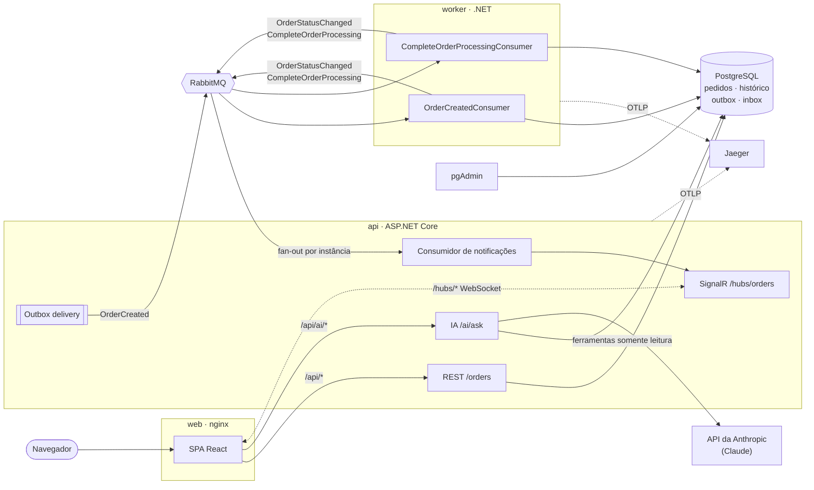
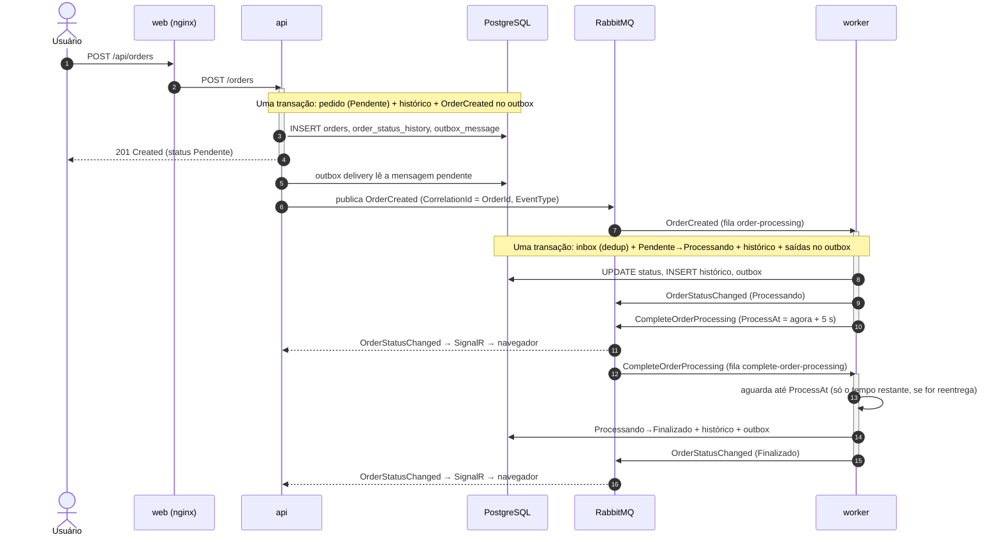
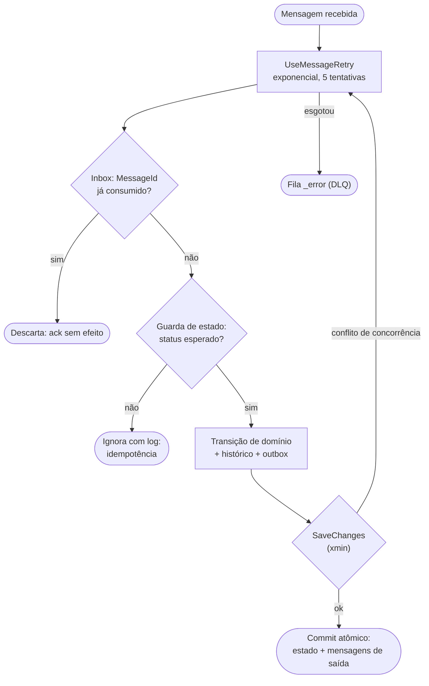
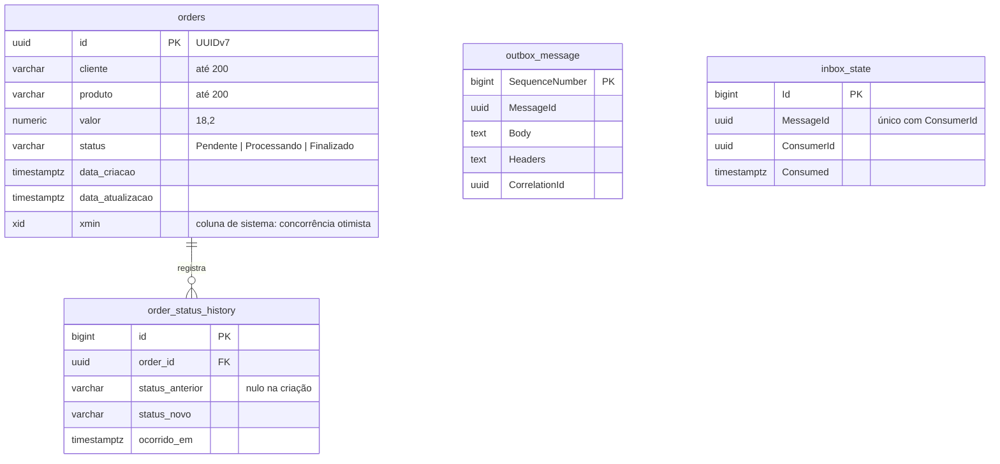
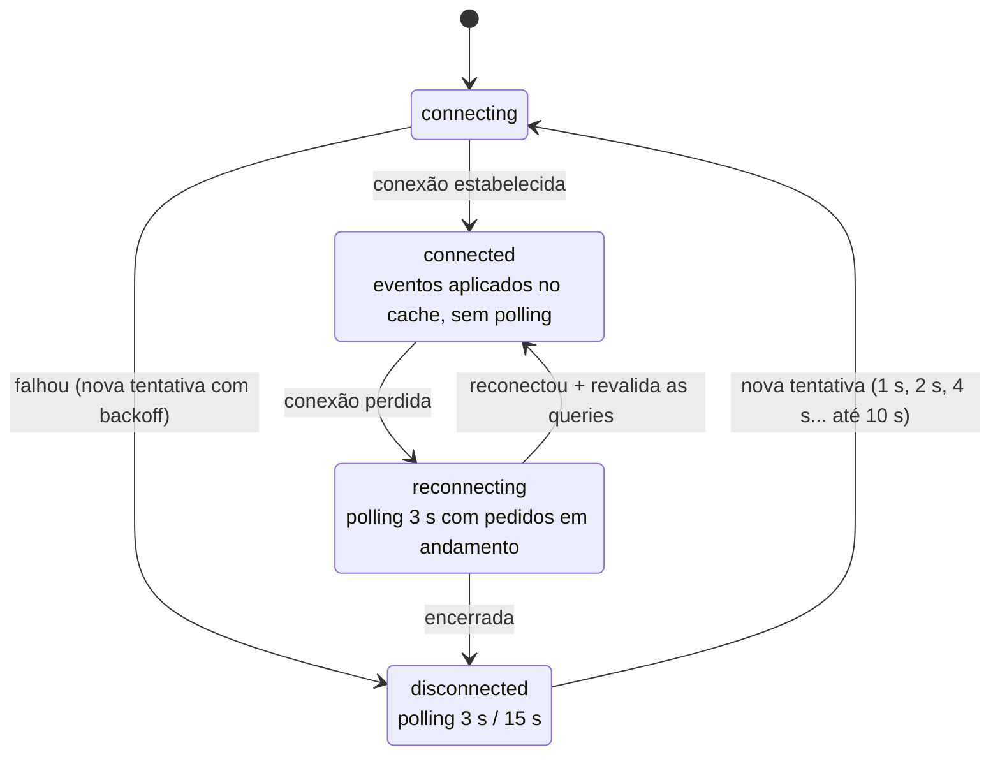
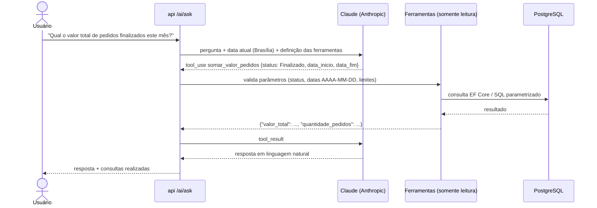
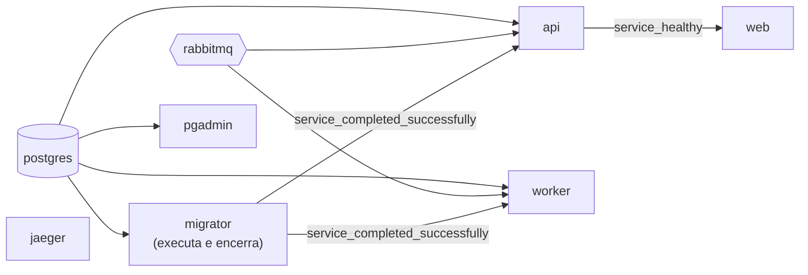

# Arquitetura

Visão detalhada dos componentes, fluxos e decisões. Para executar o projeto, veja o [README](../README.md).

- [Componentes](#componentes)
- [Ciclo de vida de um pedido](#ciclo-de-vida-de-um-pedido)
- [Confiabilidade da mensageria](#confiabilidade-da-mensageria)
- [Modelo de dados](#modelo-de-dados)
- [Tempo real com fallback](#tempo-real-com-fallback)
- [Pergunte sobre os pedidos (IA)](#pergunte-sobre-os-pedidos-ia)
- [Observabilidade](#observabilidade)
- [Orquestração](#orquestração)
- [Organização do código](#organização-do-código)

## Componentes



| Componente | Responsabilidade |
|---|---|
| **web** | Serve a SPA e faz proxy de `/api` e `/hubs` para a API (mesma origem, sem CORS). Resolve o host da API a cada requisição (DNS do Docker) e falha em 3 s se ela estiver fora. |
| **api** | Endpoints REST, validação, ProblemDetails, Outbox, hub SignalR, consumidor de notificações e módulo de IA. |
| **worker** | Processa os pedidos de forma assíncrona e idempotente. Expõe apenas health checks. |
| **migrator** | Aplica as migrations do EF Core (bundle) e encerra; API e worker só sobem depois dele. |
| **PostgreSQL** | Pedidos, histórico de status e as tabelas de Outbox/Inbox do MassTransit, na mesma base para garantir atomicidade. |
| **RabbitMQ** | Transporte das mensagens, com retentativas e filas `_error` (DLQ). |
| **Jaeger** | Recebe e exibe os traces distribuídos (OpenTelemetry). |

## Ciclo de vida de um pedido



**Por que duas mensagens no worker?** Com o Outbox/Inbox do MassTransit, todo o processamento de uma mensagem acontece em **uma** transação de banco. Gravar "Processando", esperar 5 s e gravar "Finalizado" no mesmo consumo deixaria o estado intermediário invisível até o fim. Por isso cada etapa é uma mensagem com sua própria transação: "Processando" fica visível imediatamente, e uma queda no meio do caminho é retomada pela reentrega da mensagem pendente.

**Por que a espera fica no consumidor?** A mensagem carrega o instante-alvo (`ProcessAt`), então uma reentrega espera só o tempo restante, sem depender de plugins no broker. Em produção, com volume alto, a espera poderia ir para um agendador (plugin de delayed exchange do RabbitMQ ou Quartz) para não ocupar slots do consumidor.

## Confiabilidade da mensageria



| Garantia | Como |
|---|---|
| Pedido nunca é salvo sem a mensagem, nem a mensagem enviada sem o pedido | **Transactional Outbox** (EF Core): a mensagem é gravada na mesma transação e entregue depois por um serviço em background |
| Reentrega com o mesmo `MessageId` não reprocessa | **Inbox** (tabela `inbox_state`) |
| Mensagem duplicada com outro `MessageId` não reprocessa | **Guarda de estado** no consumidor + regra de domínio (`Order.TransitionTo` só aceita a sequência Pendente → Processando → Finalizado) |
| Consumidores concorrentes não aplicam a mesma transição | **Concorrência otimista** via coluna de sistema `xmin` do PostgreSQL; o perdedor é retentado e cai na guarda |
| Falhas transitórias | Retry exponencial fora da transação (cada tentativa com escopo novo); `DomainException` não é retentada |
| Falhas definitivas | Fila `_error` (DLQ) do MassTransit |
| Rastreabilidade | `CorrelationId = OrderId` e header `EventType` em toda mensagem de pedido (filtros de publish/send, inclusive via Outbox) |

Todos esses cenários são exercitados nos testes de integração contra RabbitMQ e PostgreSQL reais (`tests/Orders.IntegrationTests/MessagingTests.cs`), incluindo cinco duplicatas consumidas em paralelo.

## Modelo de dados



Os nomes de colunas de `orders` seguem o enunciado (`cliente`, `produto`, `valor`, `status`, `data_criacao`). O histórico alimenta a linha do tempo no frontend e o cálculo de tempo médio de processamento no módulo de IA.

## Tempo real com fallback



- A API consome `OrderCreated` e `OrderStatusChanged` numa **fila exclusiva por instância** (auto-delete), garantindo que cada instância receba todos os eventos e notifique os seus clientes.
- O frontend aplica os eventos direto no cache do TanStack Query, ignorando eventos duplicados ou fora de ordem (o status nunca regride).
- Sem conexão, o polling assume; ao reconectar, as queries são revalidadas para recuperar eventos perdidos.
- Chamadas HTTP têm timeout (10 s) e o nginx falha em 3 s se a API estiver fora, para que nenhuma requisição pendurada trave o fallback.

## Pergunte sobre os pedidos (IA)



- **A IA nunca escreve SQL.** Ela escolhe entre ferramentas tipadas (`contar_pedidos`, `somar_valor_pedidos`, `tempo_medio_processamento`, `listar_pedidos`) e a API valida cada parâmetro; erros voltam ao modelo como `tool_result` com `is_error` para ele corrigir.
- Datas relativas ("hoje", "este mês") são interpretadas no fuso `America/Sao_Paulo`.
- "Tempo para aprovar" é calculado pelo histórico de status (criação → Finalizado), agregado no PostgreSQL.
- Proteções: limite de tamanho da pergunta, limite de rodadas de ferramentas, rate limit por IP e módulo desativado sem `ANTHROPIC_API_KEY`.
- Modelo `claude-opus-5-5` (configurável) com esforço `low` e fallback do lado do servidor para recusas de segurança.

## Observabilidade

Um único trace cobre o fluxo inteiro de um pedido, atravessando HTTP, Outbox, RabbitMQ, os dois consumidores do worker e as notificações na API, com os comandos SQL de cada etapa:

```
POST /orders                                   [orders-api]   order.status=Pendente
└─ outbox send → OrderCreated send
   ├─ notifications receive                    [orders-api]
   └─ order-processing receive/process         [orders-worker] order.status=Processando
      ├─ postgresql SELECT / INSERT / UPDATE
      ├─ OrderStatusChanged send → notifications [orders-api]
      └─ complete-order-processing receive/process [orders-worker] order.status=Finalizado
         └─ OrderStatusChanged send → notifications [orders-api]
```

- Spans de banco são nomeados pela operação SQL; spans de banco órfãos (polling do Outbox, health checks) são descartados.
- Tags de negócio `order.id` e `order.status` permitem buscar o trace de um pedido no Jaeger.
- Os logs incluem `TraceId`/`SpanId`.

## Orquestração



Todos os serviços têm healthcheck; as dependências usam `service_healthy` / `service_completed_successfully`, então `docker compose up` sobe tudo na ordem correta. As imagens .NET usam Alpine e rodam como usuário não-root; o frontend usa `nginx-unprivileged`.

## Organização do código

```
src/
  Orders.Domain/            Order, OrderStatus, OrderStatusHistory e as regras de transição
  Orders.Contracts/         Mensagens (OrderCreated, OrderStatusChanged, CompleteOrderProcessing), sem dependências
  Orders.Infrastructure/    EF Core + migrations, MassTransit (Outbox/Inbox, filtros), health checks, OpenTelemetry
  Orders.Api/
    Features/Orders/        Endpoints REST e contratos HTTP
    Features/Ai/            Módulo de IA: assistente, ferramentas, consultas analíticas, fuso
    Realtime/               Hub SignalR e consumidor de notificações
    ErrorHandling/          ProblemDetails padronizado
  Orders.Worker/
    Processing/             Consumidores idempotentes
web/src/
  api/                      Cliente HTTP tipado (ProblemDetails, timeout)
  features/orders/          Queries, cache em tempo real, componentes de pedidos
  features/assistant/       Rótulos das consultas da IA
  realtime/                 Conexão SignalR, estado e indicador
  pages/                    Telas
tests/
  Orders.UnitTests/         Domínio e observabilidade
  Orders.IntegrationTests/  Testcontainers + Verify (golden) + IA com modelo simulado
```

O domínio não depende de nenhum framework; `Contracts` não depende de nada; a infraestrutura concentra as integrações; API e Worker são composições finas sobre elas.
